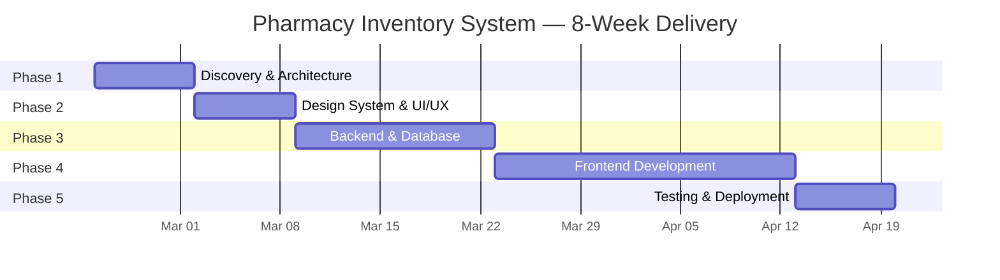

# 📅 Project Plan — Pharmacy Inventory Management System

> **Duration:** 8 Weeks · **Team:** Full-Stack Development  
> **Stack:** .NET 10 · Angular · PrimeNG · PostgreSQL

---

## Phase Overview

---

## Phase 1 — Discovery & Architecture (Week 1)

| Deliverable | Description |
|---|---|
| Requirements Document | FR / NFR / CON specification signed off by stakeholders |
| ER Diagram | Complete entity-relationship diagram with all constraints |
| System Architecture | API structure, data-flow diagrams, security layers |
| Repository Setup | Git repo with `.NET 10` backend + `Angular` frontend scaffolds |
| Database Schema | Initial PostgreSQL schema applied via EF Core migration |

### Milestone Gate
- [ ] Architecture Review approved
- [ ] ER Diagram signed off

---

## Phase 2 — Design System & UI/UX (Week 2)

| Deliverable | Description |
|---|---|
| Color Palette | Light & Dark mode tokens (Mint Green primary) |
| Typography Scale | 9-level type ramp with Inter / SF Pro |
| Component Library | Angular + PrimeNG theme overrides |
| Wireframes | Login · Dashboard · Medicine Master · Inventory · Supplier · Alerts |

### Milestone Gate
- [ ] Design System document reviewed
- [ ] Wireframes approved by stakeholders

---

## Phase 3 — Backend & Database (Weeks 3–4)

| Deliverable | Description |
|---|---|
| CRUD APIs | Endpoints for Employee, Medicine, Inventory Batch, Transaction, Supplier, Category |
| Database Config | PostgreSQL with connection string, EF Core migrations |
| JWT Auth | Token validation middleware + role-based authorization |
| Password Security | BCrypt hashing implementation |
| Error Handling | Standardized API response models and error codes |

### Milestone Gate
- [ ] All API endpoints return correct responses (Postman/Swagger)
- [ ] JWT flow verified end-to-end
- [ ] Database migrations run cleanly on fresh instance

---

## Phase 4 — Frontend Development (Weeks 5–7)

| Deliverable | Description |
|---|---|
| Screen Implementation | All primary screens built with PrimeNG components |
| API Integration | HTTP service layer connecting Angular ↔ .NET 10 |
| Data Tables | Filtering, sorting, pagination for inventory management |
| Dashboard | Key metrics cards, charts for stock levels, expiry tracking |
| Alerts System | Low Stock + FEFO visual indicators |
| Forms | Medicine Master, Stock In/Out, Supplier CRUD |
| Design Compliance | Colors, typography, spacing applied per Design System |

### Milestone Gate
- [ ] All screens functional with live API data
- [ ] Responsive behavior verified at 375px / 768px / 1440px
- [ ] Design System compliance audit passed

---

## Phase 5 — Testing & Deployment (Week 8)

| Deliverable | Description |
|---|---|
| UAT | Stakeholder acceptance testing with feedback cycles |
| Responsive QA | Cross-device testing (Mobile / Tablet / Desktop) |
| Performance Testing | API response < 200ms verified |
| Security Audit | JWT + password hashing penetration tests |
| Production Deploy | Server deployment with migration scripts |
| Documentation | User manuals and training materials |

### Milestone Gate
- [ ] UAT sign-off
- [ ] Performance benchmarks met
- [ ] Production environment live and stable

---

## Risk Register

| Risk | Likelihood | Impact | Mitigation |
|---|---|---|---|
| PostgreSQL schema changes mid-sprint | Medium | High | Freeze schema after Phase 3 gate review |
| PrimeNG component limitations | Low | Medium | Identify early in Phase 2; plan custom fallbacks |
| JWT token expiry edge cases | Medium | High | Implement refresh token flow + graceful 401 handling |
| Responsive breakpoint regressions | Medium | Medium | Automated visual regression tests (Cypress) |
