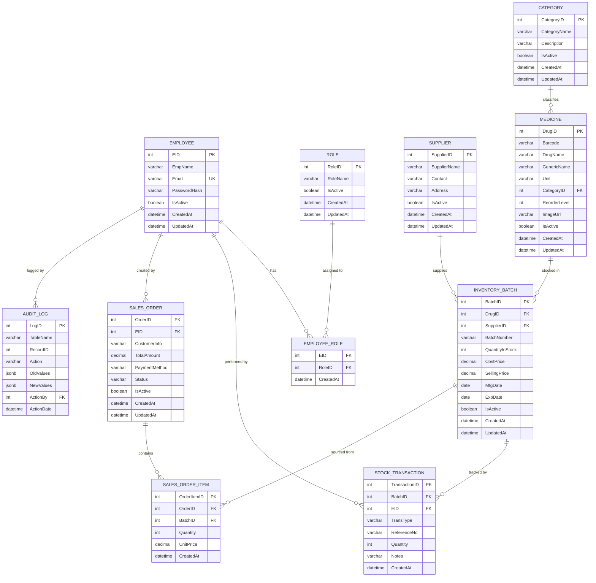

# 🗄️ Database Architecture

> Pharmacy Inventory Management System  
> Engine: PostgreSQL · ORM: Entity Framework Core · Runtime: .NET 10

---

## Entity-Relationship Diagram



---

## Table Descriptions

### Core Entities

| Table | Purpose | Key Relationships |
|---|---|---|
| `EMPLOYEE` | System users (Admin, Pharmacist, Stock Employee) | → EMPLOYEE_ROLE, STOCK_TRANSACTION, SALES_ORDER, AUDIT_LOG |
| `ROLE` | Role definitions for RBAC | → EMPLOYEE_ROLE |
| `EMPLOYEE_ROLE` | Many-to-many junction (Employee ↔ Role) | Composite PK (EID, RoleID) |
| `SUPPLIER` | Drug suppliers/vendors | → INVENTORY_BATCH |
| `CATEGORY` | Medicine classification | → MEDICINE |
| `MEDICINE` | Drug master data | → INVENTORY_BATCH |

### Inventory & Transactions

| Table | Purpose | Key Relationships |
|---|---|---|
| `INVENTORY_BATCH` | Per-batch stock tracking with pricing and expiry | → STOCK_TRANSACTION, SALES_ORDER_ITEM |
| `STOCK_TRANSACTION` | Immutable log of all stock movements | Types: `IN`, `OUT`, `ADJUST`, `EXPIRED` |
| `SALES_ORDER` | Sales/dispensing header | → SALES_ORDER_ITEM |
| `SALES_ORDER_ITEM` | Line items per sale, linked to specific batch | FEFO-driven batch selection |

### System

| Table | Purpose | Notes |
|---|---|---|
| `AUDIT_LOG` | Centralized change tracking (the "CCTV" table) | Stores JSON snapshots of old/new values |

---

## Indexing Strategy

```sql
-- Performance-critical indexes
CREATE INDEX idx_medicine_category ON "MEDICINE" ("CategoryID");
CREATE INDEX idx_medicine_barcode ON "MEDICINE" ("Barcode");
CREATE INDEX idx_medicine_name ON "MEDICINE" ("DrugName");

CREATE INDEX idx_batch_drug ON "INVENTORY_BATCH" ("DrugID");
CREATE INDEX idx_batch_supplier ON "INVENTORY_BATCH" ("SupplierID");
CREATE INDEX idx_batch_expdate ON "INVENTORY_BATCH" ("ExpDate");  -- FEFO queries

CREATE INDEX idx_transaction_batch ON "STOCK_TRANSACTION" ("BatchID");
CREATE INDEX idx_transaction_date ON "STOCK_TRANSACTION" ("CreatedAt");
CREATE INDEX idx_transaction_employee ON "STOCK_TRANSACTION" ("EID");

CREATE INDEX idx_salesorder_employee ON "SALES_ORDER" ("EID");
CREATE INDEX idx_salesorder_date ON "SALES_ORDER" ("CreatedAt");

CREATE INDEX idx_audit_table_record ON "AUDIT_LOG" ("TableName", "RecordID");
CREATE INDEX idx_audit_date ON "AUDIT_LOG" ("ActionDate");
```

---

## FEFO Query Pattern

The **First Expire, First Out** strategy is critical for pharmaceutical inventory. When dispensing stock, always select batches with the earliest expiration date first:

```sql
-- Get available batches for a drug, ordered FEFO
SELECT b."BatchID", b."BatchNumber", b."QuantityInStock", b."ExpDate"
FROM "INVENTORY_BATCH" b
WHERE b."DrugID" = @DrugId
  AND b."QuantityInStock" > 0
  AND b."IsActive" = true
  AND b."ExpDate" > CURRENT_DATE
ORDER BY b."ExpDate" ASC;
```

---

## Backend Setup Instructions

### 1. Connection String

Add to `appsettings.json`:

```json
{
  "ConnectionStrings": {
    "DefaultConnection": "Host=localhost;Database=phardb;Username=postgres;Password=123456"
  }
}
```

### 2. EF Core Configuration

Register in `Program.cs`:

```csharp
builder.Services.AddDbContext<PharmacyDbContext>(options =>
    options.UseNpgsql(builder.Configuration.GetConnectionString("DefaultConnection")));
```

### 3. Run Migrations

```bash
# Install EF Core tools (if not installed)
dotnet tool install --global dotnet-ef

# Create initial migration
dotnet ef migrations add InitialCreate

# Apply to PostgreSQL
dotnet ef database update
```

### 4. JWT Authentication Setup

Add to `Program.cs`:

```csharp
builder.Services.AddAuthentication(JwtBearerDefaults.AuthenticationScheme)
    .AddJwtBearer(options =>
    {
        options.TokenValidationParameters = new TokenValidationParameters
        {
            ValidateIssuer = true,
            ValidateAudience = true,
            ValidateLifetime = true,
            ValidateIssuerSigningKey = true,
            ValidIssuer = builder.Configuration["Jwt:Issuer"],
            ValidAudience = builder.Configuration["Jwt:Audience"],
            IssuerSigningKey = new SymmetricSecurityKey(
                Encoding.UTF8.GetBytes(builder.Configuration["Jwt:Key"]!))
        };
    });

builder.Services.AddAuthorization(options =>
{
    options.AddPolicy("AdminOnly", policy => policy.RequireRole("Admin"));
    options.AddPolicy("PharmacistUp", policy => policy.RequireRole("Admin", "Pharmacist"));
    options.AddPolicy("AllStaff", policy => policy.RequireRole("Admin", "Pharmacist", "StockEmployee"));
});
```

### 5. Password Hashing

```csharp
// Using BCrypt.Net-Next NuGet package
public class PasswordService
{
    public string HashPassword(string password)
        => BCrypt.Net.BCrypt.HashPassword(password, workFactor: 12);

    public bool VerifyPassword(string password, string hash)
        => BCrypt.Net.BCrypt.Verify(password, hash);
}
```

---

## Soft-Delete Convention

All entities use `IsActive` boolean flag:
- **Active records**: `IsActive = true` (default)
- **Deleted records**: `IsActive = false`
- **Global query filter** in EF Core: `.HasQueryFilter(e => e.IsActive)`
- Exception: `STOCK_TRANSACTION` and `AUDIT_LOG` are **append-only** (no soft-delete)
