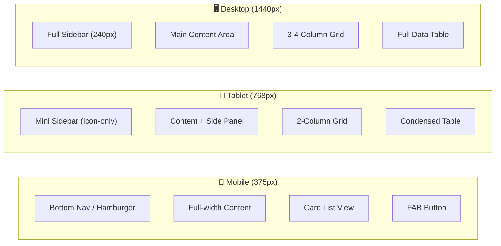

# 📱 Responsive Design & Layout Strategy

> Pharmacy Inventory Management System  
> Breakpoints: 375px (Mobile) · 768px (Tablet) · 1440px (Desktop)

---

## Breakpoint Definitions

```css
/* Mobile-first approach */
$breakpoint-mobile:  375px;   /* Phones */
$breakpoint-tablet:  768px;   /* iPad Portrait */
$breakpoint-desktop: 1024px;  /* Laptops */
$breakpoint-wide:    1440px;  /* Full Desktop */

/* SCSS Mixins */
@mixin tablet  { @media (min-width: 768px)  { @content; } }
@mixin desktop { @media (min-width: 1024px) { @content; } }
@mixin wide    { @media (min-width: 1440px) { @content; } }
```

---

## Layout Architecture



---

## 1. Mobile Layout (375px)

### Navigation
- **Replace** sidebar with **Bottom Navigation Bar** (5 tabs max): Dashboard · Medicines · Inventory · Alerts · More
- **Alternative:** Hamburger menu (☰) in top-left with slide-out drawer
- Tab icons use PrimeIcons at 24px with 10px caption text below

### Data Display
| Desktop Component | Mobile Adaptation |
|---|---|
| Data Table | **Card-based List View** — each card shows: Medicine Name, Stock Qty, Status Badge |
| Dashboard grid (3-4 cols) | **Single column stack** — metric cards scroll vertically |
| Detail modals | **Full-screen overlay** with back-arrow navigation |
| Multi-column forms | **Single column** — all fields stack vertically |
| Sidebar filters | **Bottom sheet** or **filter icon** that opens overlay panel |

### Key Components

```
┌──────────────────────────┐
│  ☰  Pharmacy Inventory   🔔│  ← Top bar (56px)
├──────────────────────────┤
│                            │
│  ┌────────────────────┐   │
│  │  💊 Paracetamol     │   │  ← Medicine Card
│  │  Stock: 234  ● OK   │   │     (Name + Qty + Badge)
│  └────────────────────┘   │
│                            │
│  ┌────────────────────┐   │
│  │  💊 Amoxicillin     │   │
│  │  Stock: 12   ⚠ LOW  │   │  ← Warning badge
│  └────────────────────┘   │
│                            │
│  ┌────────────────────┐   │
│  │  💊 Ibuprofen       │   │
│  │  Stock: 0   🔴 OUT  │   │  ← Critical badge
│  └────────────────────┘   │
│                            │
│              ╭───╮         │
│              │ + │         │  ← FAB (56px, bottom-right)
│              ╰───╯         │
├──────────────────────────┤
│ 🏠  💊  📦  🔔  ⋯       │  ← Bottom Navigation
└──────────────────────────┘
```

### Content Priority (Mobile)
1. Quick stock overview (card list)
2. Expiring drug alerts (top banner or badge count)
3. Barcode scanning shortcut (camera icon in FAB menu)
4. Single-action Stock In/Out forms

---

## 2. Tablet Layout (768px)

### Navigation
- **Mini Sidebar** (72px width) showing icons only
- Expand to full sidebar on hover or tap (with overlay backdrop)
- Top bar remains for breadcrumbs and user profile

### Data Display
| Desktop Component | Tablet Adaptation |
|---|---|
| Full Data Table | **Condensed Table** — hide: Supplier Name, Mfg Date, Notes. Show "Details" expand row |
| Dashboard grid (3-4 cols) | **2-column grid** |
| Wide forms | **2-column grid layout** for form fields |
| Full modals | **3/4-width dialog** (centered) |
| Sidebar filters | **Collapsible filter panel** above table |

### Key Components

```
┌─────────────────────────────────────────┐
│ 🏠│   Inventory Management        🔔 👤│
│ 💊│─────────────────────────────────────│
│ 📦│                                     │
│ 🔔│  ┌──────────┐  ┌──────────┐       │
│ 👥│  │ Total     │  │ Low Stock│       │  ← 2-col metrics
│ ⚙ │  │   1,245   │  │    23    │       │
│   │  └──────────┘  └──────────┘       │
│   │                                     │
│   │  ┌─────────────────────────────┐   │
│   │  │ Name     │ Stock │ Status  │   │  ← Condensed table
│   │  │──────────│───────│─────────│   │
│   │  │ Paracet..│  234  │  ● OK   │   │
│   │  │ Amoxici..│   12  │  ⚠ LOW  │   │
│   │  └─────────────────────────────┘   │
└─────────────────────────────────────────┘
```

### Form Layout (Tablet)

```
┌─────────────────────────────────────┐
│  Add New Medicine                    │
│─────────────────────────────────────│
│  Drug Name          │  Generic Name │  ← 2-column grid
│  [_______________]  │  [__________] │
│                     │               │
│  Category           │  Unit         │
│  [▼ Select...]      │  [▼ Box   ]  │
│                     │               │
│  Reorder Level      │  Barcode      │
│  [_______________]  │  [__________] │
│─────────────────────────────────────│
│              [Cancel]  [Save]        │
└─────────────────────────────────────┘
```

---

## 3. Desktop Layout (1440px)

### Navigation
- **Full Sidebar** (240px) permanently visible on left
- Sidebar shows: Logo, nav links with icon + label, user profile at bottom
- Optional: collapsible to mini-sidebar (72px) via toggle button

### Data Display
| Component | Desktop Implementation |
|---|---|
| Data Table | **Full PrimeNG Table** — all columns visible, inline actions, advanced Filter/Sort/Paginator |
| Dashboard | **3-4 column grid** with charts (bar, line, pie) |
| Forms | **Full-width dialogs** or dedicated pages with multi-section layouts |
| Sidebar | Always visible, full labels |
| Filters | **Inline filter row** in table header + sidebar filter panel |

### Key Components

```
┌────────────────────────────────────────────────────────────────────┐
│ 🏥 PharmaSys      │  Inventory Management                🔔  👤  │
│                    │                                              │
│  🏠 Dashboard      │  ┌──────┐ ┌──────┐ ┌──────┐ ┌──────┐      │
│  💊 Medicines      │  │Total │ │Low St│ │Expir.│ │Today │      │
│  📦 Inventory      │  │1,245 │ │  23  │ │  8   │ │  45  │      │  ← 4-col metrics
│  🔔 Alerts         │  └──────┘ └──────┘ └──────┘ └──────┘      │
│  👥 Suppliers      │                                              │
│  📊 Reports        │  ┌─────────────────────────────────────┐    │
│  ⚙  Settings       │  │ Name    │Category│Stock│Exp   │ Act│    │  ← Full table
│                    │  │─────────│────────│─────│──────│────│    │
│                    │  │Paracet..│Pain    │ 234 │12/26 │ ⋯  │    │
│  ─────────         │  │Amoxici..│Antibio.│  12 │03/26 │ ⋯  │    │
│  👤 Admin          │  │Ibupro..│Pain    │   0 │01/26 │ ⋯  │    │
│  🚪 Logout         │  │Cetiriz..│Allergy │  89 │08/26 │ ⋯  │    │
│                    │  └─────────────────────────────────────┘    │
│                    │  ◀ 1 2 3 ... 12 ▶   Showing 1-20 of 234    │
└────────────────────────────────────────────────────────────────────┘
```

---

## 4. Component-Level Responsive Rules

### Data Table → Card List Transform

```scss
// PrimeNG table responsive override
@media (max-width: 767px) {
  .p-datatable {
    // Hide the native table layout
    .p-datatable-thead { display: none; }
    .p-datatable-tbody > tr {
      display: flex;
      flex-direction: column;
      padding: 16px;
      margin-bottom: 8px;
      background: var(--color-surface);
      border-radius: var(--radius-md);
      box-shadow: var(--shadow-sm);
      border: 1px solid var(--color-border);

      > td {
        display: flex;
        justify-content: space-between;
        padding: 4px 0;
        border: none;

        &::before {
          content: attr(data-label);
          font-weight: 600;
          color: var(--color-text-secondary);
          font-size: 12px;
          text-transform: uppercase;
        }
      }
    }
  }
}
```

### Sidebar Responsive Behavior

```scss
.app-sidebar {
  width: 240px;
  position: fixed;
  left: 0;
  top: 0;
  height: 100vh;
  background: var(--color-surface);
  border-right: 1px solid var(--color-border);
  transition: width 300ms ease;
  z-index: 100;

  @media (max-width: 1023px) {
    width: 72px; // Mini sidebar — icons only
    .nav-label { display: none; }
  }

  @media (max-width: 767px) {
    width: 0;
    transform: translateX(-100%);
    &.open {
      width: 280px;
      transform: translateX(0);
    }
  }
}
```

### Dashboard Grid

```scss
.dashboard-grid {
  display: grid;
  gap: 16px;
  grid-template-columns: 1fr;               // Mobile: 1 col

  @include tablet  { grid-template-columns: repeat(2, 1fr); }  // Tablet: 2 cols
  @include desktop { grid-template-columns: repeat(3, 1fr); }  // Desktop: 3 cols
  @include wide    { grid-template-columns: repeat(4, 1fr); }  // Wide: 4 cols
}
```

### FAB (Floating Action Button) — Mobile Only

```scss
.fab {
  display: none;

  @media (max-width: 767px) {
    display: flex;
    position: fixed;
    bottom: 80px; // Above bottom nav
    right: 16px;
    width: 56px;
    height: 56px;
    border-radius: 50%;
    background: var(--color-primary);
    color: white;
    align-items: center;
    justify-content: center;
    box-shadow: var(--shadow-md);
    z-index: 50;
    font-size: 24px;

    &:active { transform: scale(0.95); }
  }
}
```

---

## 5. Touch & Interaction Guidelines

| Guideline | Value |
|---|---|
| Minimum touch target size | 44 × 44px (Apple HIG standard) |
| Touch target spacing | ≥ 8px between interactive elements |
| Swipe actions on list items | Swipe left: Delete · Swipe right: Edit |
| Pull-to-refresh | Enabled on list views (mobile/tablet) |
| Long-press | Show context menu on mobile |

---

## 6. Responsive Testing Matrix

| Screen | Mobile (375px) | Tablet (768px) | Desktop (1440px) |
|---|:---:|:---:|:---:|
| Login | ✅ Full-screen centered | ✅ Card centered | ✅ Split-screen (image + form) |
| Dashboard | ✅ 1-col stack | ✅ 2-col grid | ✅ 4-col grid + charts |
| Medicine List | ✅ Card list | ✅ Condensed table | ✅ Full table |
| Medicine Form | ✅ 1-col stack | ✅ 2-col grid | ✅ Dialog with sections |
| Inventory Batch | ✅ Card list | ✅ Condensed table | ✅ Full table + filters |
| Stock In/Out | ✅ Full-screen form | ✅ Half-page dialog | ✅ Side panel or dialog |
| Alerts | ✅ Card list + badge | ✅ Table with badges | ✅ Table with inline actions |
| Supplier List | ✅ Card list | ✅ Table | ✅ Full table |
| Audit Log | ❌ Link to desktop | ✅ Condensed table | ✅ Full table with JSON viewer |
